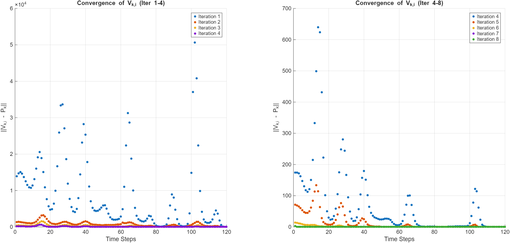
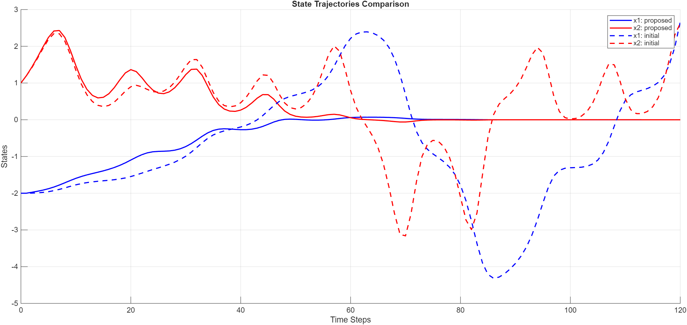
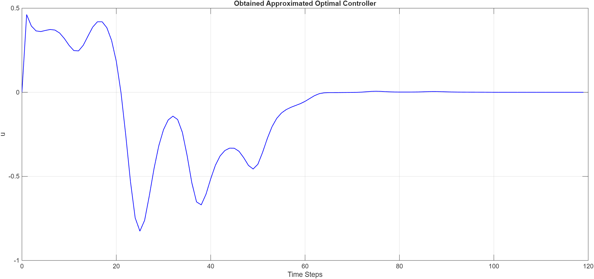

# Data-Driven Optimal Control via Offline Policy Iteration

[](https://www.mathworks.com/products/matlab.html)
[](LICENSE)
[](paper/Data-driven_Finite-horizon_Optimal_Control_for_Linear_Time-varying_Discrete-time_Systems.pdf)

A MATLAB implementation and numerical validation of a **model-free, off-policy Policy Iteration (PI) algorithm for finite-horizon LQR control of linear time-varying (LTV) discrete-time systems**. The system dynamics are treated as a black box: the controller is learned entirely from a single batch of measured state/input trajectories, with no access to the system matrices at design time.

This repository reproduces Algorithm 1 of:

> B. Pang, T. Bian, and Z.-P. Jiang, "Data-driven Finite-horizon Optimal Control for Linear Time-varying Discrete-time Systems," in *2018 IEEE Conference on Decision and Control (CDC)*, pp. 861–866, 2018.

and benchmarks it against the exact, model-based Riccati solution.

## Table of Contents
- [Problem Formulation](#problem-formulation)
- [Method](#method)
- [Repository Structure](#repository-structure)
- [Results](#results)
- [Getting Started](#getting-started)
- [Reference](#reference)
- [Author](#author)
- [License](#license)

## Problem Formulation

Consider the linear time-varying discrete-time system

```
x_{k+1} = A_k x_k + B_k u_k,    k = 0, 1, ..., N-1
```

and the finite-horizon quadratic cost

```
J = Σ_{k=0}^{N-1} ( x_k' Q_k x_k + u_k' R_k u_k )  +  x_N' F x_N
```

The classical solution proceeds by solving the time-varying Riccati difference equation backward from `k = N` to `k = 0`, which requires exact knowledge of `A_k` and `B_k` at every step. This project investigates the alternative: **can the optimal time-varying gain sequence `L_k` be recovered using only measured trajectory data, without ever identifying or using `A_k`, `B_k` explicitly?**

## Method

The repository builds up to the data-driven solution in three stages:

| Stage | Script | Knowledge of `A_k`, `B_k`? |
|---|---|---|
| 1. Exact optimal control | `src/syssim.m` | Full — solves the backward Riccati equation directly |
| 2. Model-based Policy Iteration | `src/PIdemo.m` | Full — iterates a Lyapunov-equation value update + policy improvement |
| 3. **Data-driven off-policy PI** | `src/off_policy.m` | **None** — learns from trajectory data only |

### Off-policy Policy Iteration (Algorithm 1)

1. **Data collection.** Starting from random initial states, drive the (unknown) system with a rich exploration input — a sum of 500 random sinusoids per episode — for `l` independent episodes. Record every `(x_k, u_k, x_{k+1})` triple. This satisfies the rank condition needed for the regression below and is collected **once, offline**; the same batch is reused across every PI iteration.
2. **Policy evaluation + improvement, fused into one regression.** For PI iteration `i`, sweep backward over `k = N-1, ..., 0`. At each `k`, every episode contributes one row of features built from `x_k`, `u_k`, `x_{k+1}`, and the already-solved `V_{k+1}`. A single least-squares solve recovers, simultaneously:
   - the value function `V_k` of the current policy,
   - `B_k' V_{k+1} A_k`,
   - `B_k' V_{k+1} B_k`,

   without ever forming `A_k` or `B_k` individually. The policy is then improved exactly as in the model-based case:

   ```
   L_k^(i+1) = ( R_k + B_k' V_{k+1} B_k )^-1  B_k' V_{k+1} A_k
   ```
3. **Convergence.** Repeat until `max_k ‖V_k^(i) − V_k^(i-1)‖ < ε`. The algorithm is *off-policy* because the data used in every iteration was generated under the original exploration input — never under the policy currently being evaluated — and *offline* because no new data is collected between iterations.

The learned `V_k` and `L_k` are validated against the exact Riccati solution `P_k` computed independently (knowing `A_k`, `B_k`) purely as a numerical benchmark — this benchmark is never used by the algorithm itself.

## Repository Structure

```
.
├── src/
│   ├── syssim.m       Exact optimal control via the backward Riccati recursion (ground truth)
│   ├── PIdemo.m        Model-based Policy Iteration (Lyapunov value update + policy improvement)
│   ├── off_policy.m     Data-driven off-policy Policy Iteration (Algorithm 1) — main contribution
│   └── PIvsexact.m      Compares model-based PI trajectories against the exact solution
├── data/
│   ├── Exact_state_data.mat            State trajectories from the exact Riccati solution
│   └── Policy_Iterated_state_data.mat  State trajectories from each PI iteration
├── results/
│   ├── iterations.png                    ‖V_k,i − P_k‖ vs. time step, across PI iterations
│   ├── controllers_initial_proposed.png  Closed-loop trajectories: learned vs. initial controller
│   └── obtained_controller.png           Final data-driven control input
├── paper/   Reference paper (Pang, Bian & Jiang, IEEE CDC 2018)
├── report/  Full write-up with derivations, implementation notes, and detailed results
└── LICENSE
```

## Results

**Convergence of the learned value function to the exact Riccati solution.** Each point is `‖V_{k,i} − P_k‖` at a given time step; iterations are color-coded. The error collapses by roughly an order of magnitude per iteration and is essentially zero by iteration 8, despite the algorithm never using `A_k`, `B_k`.



**Closed-loop state trajectories.** Solid lines show the system under the final learned (data-driven) controller; dashed lines show the same system under the initial zero controller. The learned controller drives both states to the origin within ~50 steps, while the initial controller leaves the system oscillating.



**Learned control input.** The control signal produced by the final data-driven gain sequence, applied to the true system from `x_0 = [-2, 1]'`.



## Getting Started

**Requirements:** MATLAB (R2021a or later recommended). No additional toolboxes are required — all operations (`kron`, `pinv`, `inv`, `eig`) are part of base MATLAB.

**Run the main result:**
```matlab
src/off_policy.m   % self-contained: generates data, runs Algorithm 1, plots all results above
```

**Reproduce the exact/model-based baselines:**
```matlab
src/syssim.m       % exact Riccati-based optimal control
src/PIdemo.m        % model-based Policy Iteration
src/PIvsexact.m     % compares saved PI trajectories (data/*.mat) against the exact solution
```

## Reference

```bibtex
@inproceedings{pang2018datadriven,
  author    = {Pang, Bo and Bian, Tao and Jiang, Zhong-Ping},
  title     = {Data-driven Finite-horizon Optimal Control for Linear Time-varying Discrete-time Systems},
  booktitle = {2018 IEEE Conference on Decision and Control (CDC)},
  pages     = {861--866},
  year      = {2018},
  publisher = {IEEE}
}
```

The full PDF is included under [`paper/`](paper/) for convenience. A detailed write-up of this implementation — including derivations and extended results — is available under [`report/`](report/Ojas_Phadake_CH22B007.pdf).

## Author

**Ojas Phadake** — [@OjasPhadake](https://github.com/OjasPhadake)

## License

Released under the [MIT License](LICENSE).
